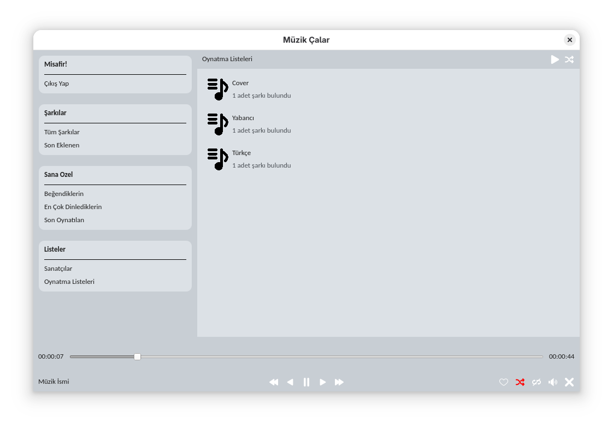
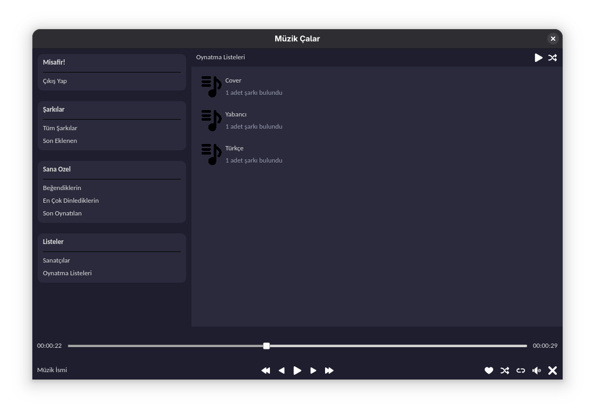
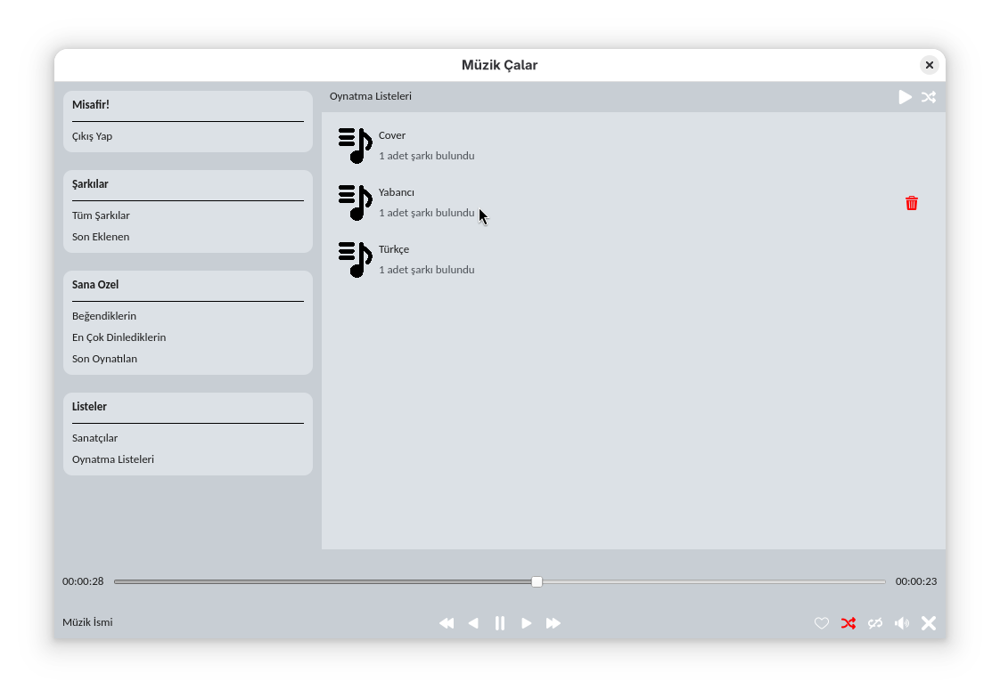
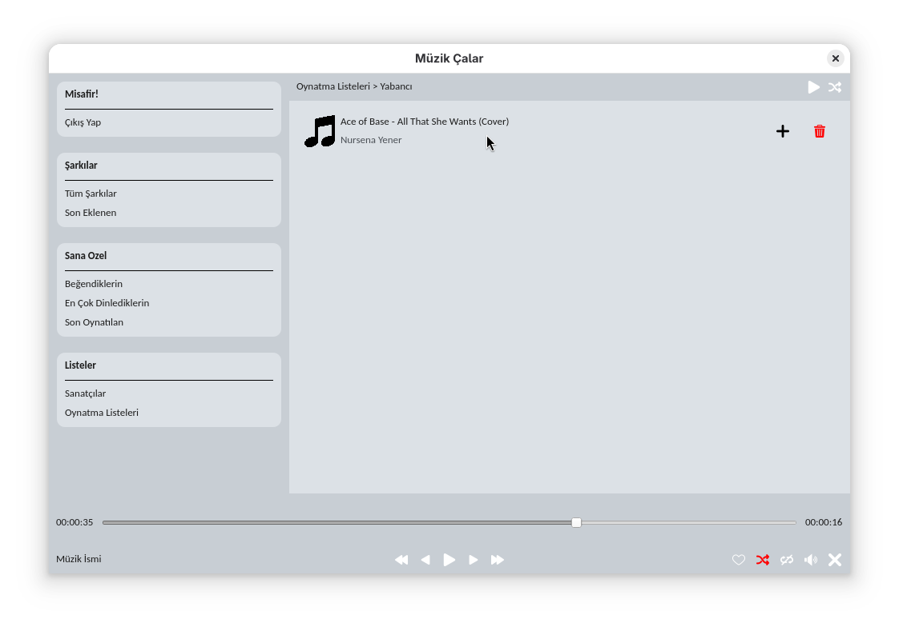
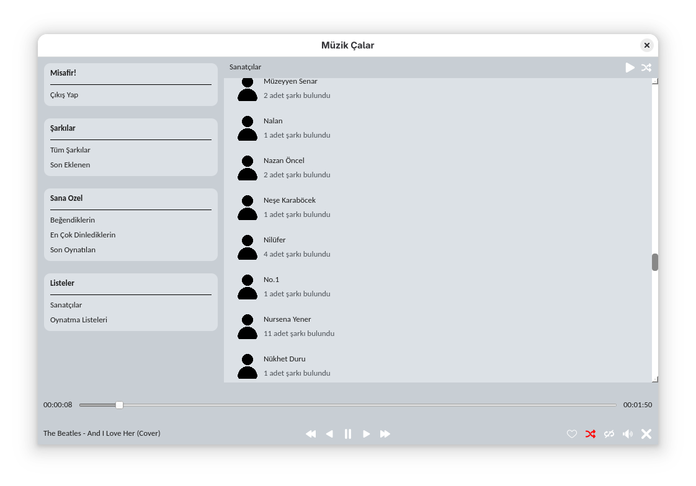
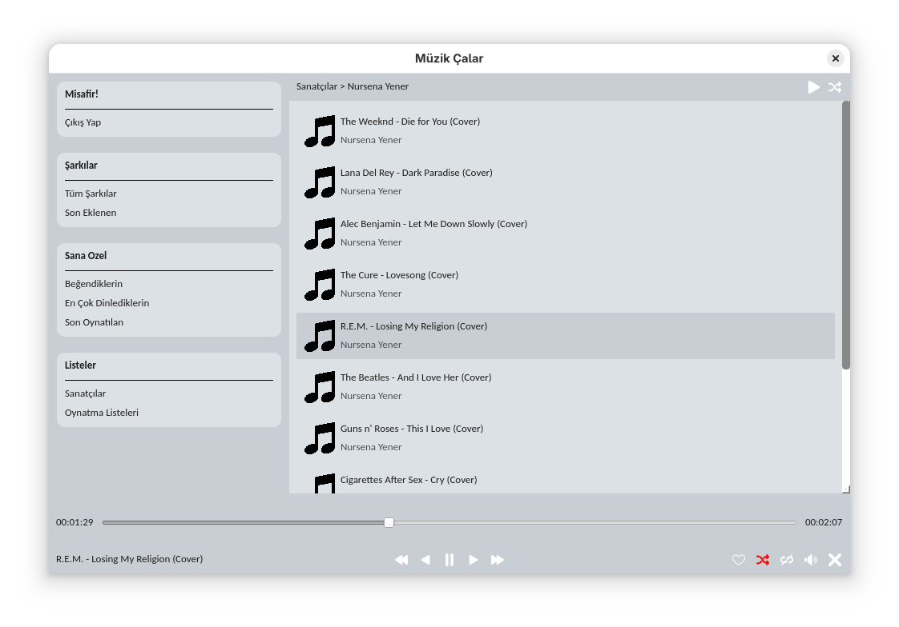
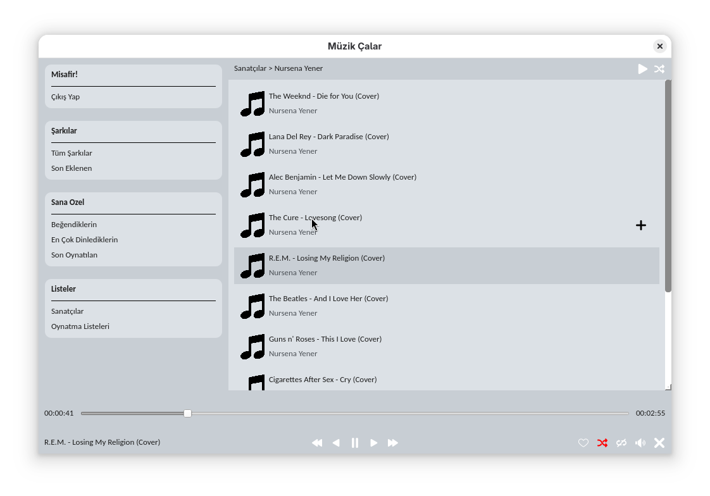
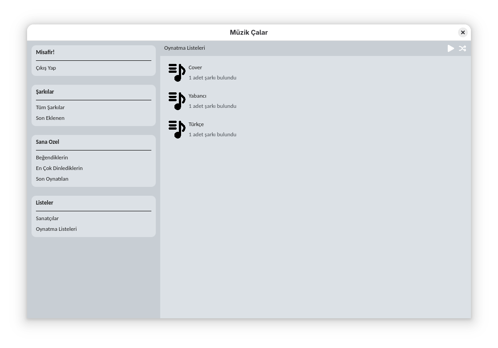

Proje kaynak kodlarına [GitHub üzerindeki bu repo](https://github.com/seymenkonuk/music_player) aracılığıyla ulaşabilirsiniz.

## Açıklama
Sunduğu özellikler:
- Kullanıcı kayıt/giriş sistemi
- E-Posta Adresi Doğrulama
- Parola Sıfırlama
- Müzik Dinleme
- Beğenilen Müzikler
- Dinleme Geçmişi
- En Çok Dinlediklerin
- En Son Eklenenler
- Oynatma Listesi
- Sanatçıya Göre Gruplama
- Liste Karıştırma
- Döngüye Alma (Döngü kapalı, liste döngüsü, şarkı döngüsü)

### Kayıt Giriş Sistemi



### Uygulama Tanıtımı



### Proje Görselleri









## Başlangıç
### Bağımlılıklar
Proje aşağıdaki işletim sistemlerinde test edilmiştir:
- **Fedora**

Projenin düzgün çalışabilmesi için aşağıdaki yazılımların sisteminizde kurulu olması gerekir:
- **Python Yorumlayıcısı 3.10**
- **pip**
- **Makefile**
- **Docker**

### Kurulum
1. Bu repository'yi kendi bilgisayarınıza klonlayın:
	```bash
	git clone https://github.com/seymenkonuk/music_player.git
	```

2. Projeye gidin:
	```bash
	cd music_player
	```

### Yapılandırma
Müziklerinizin olduğu root dizini, dinlemek istediğiniz müzik dosya uzantılarını, backend url'sini ve uygulama temasını ```frontends/desktop-app/env/.env``` dosyasına yazınız:
```bash
MUSIC_ROOT_PATH="C:/Musics"
MUSIC_FILE_EXTENSIONS=".mp3;.wav;.ogg"

API_BASE_URL="http://localhost:8000"

THEME="light"
```

Backend'in doğrulama ve şifre sıfırlama gibi işlemler için mail gönderebilmesi için ```backends/client-api/env/.env``` dosyasında aşağıdaki değişiklikleri yapınız:
```bash
EMAIL="example@example.com"
PASSWORD="example-password"
DISPLAY_NAME="Name Surname"
SMTP_HOST="smtp.example.com"
SMTP_PORT="465"
```

### Çalıştırma

Uygulama **Makefile** üzerinden kolayca çalıştırılabilir.

- **Proje için gerekli modülleri yüklemek ve backend'i build etmek için**:

	```bash
	make build
	```

- **Backend'i ve Müzik çalar uygulamasını çalıştırmak için**:

	```bash
	make run
	```

- **Backend olmadan Müzik çalar uygulamasını çalıştırmak için (giriş/kayıt çalışmaz)**:

	```bash
	make start
	```

## Atıflar

Bu projede kullanılan ikonlar [Freepik](https://www.freepik.com) tarafından tasarlanmıştır.

Icons used in this project are designed by [Freepik](https://www.freepik.com).
