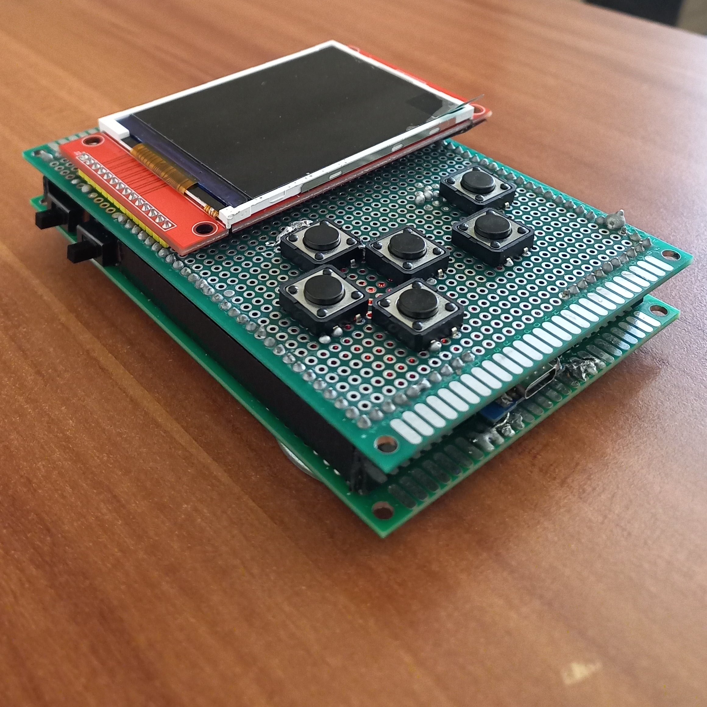
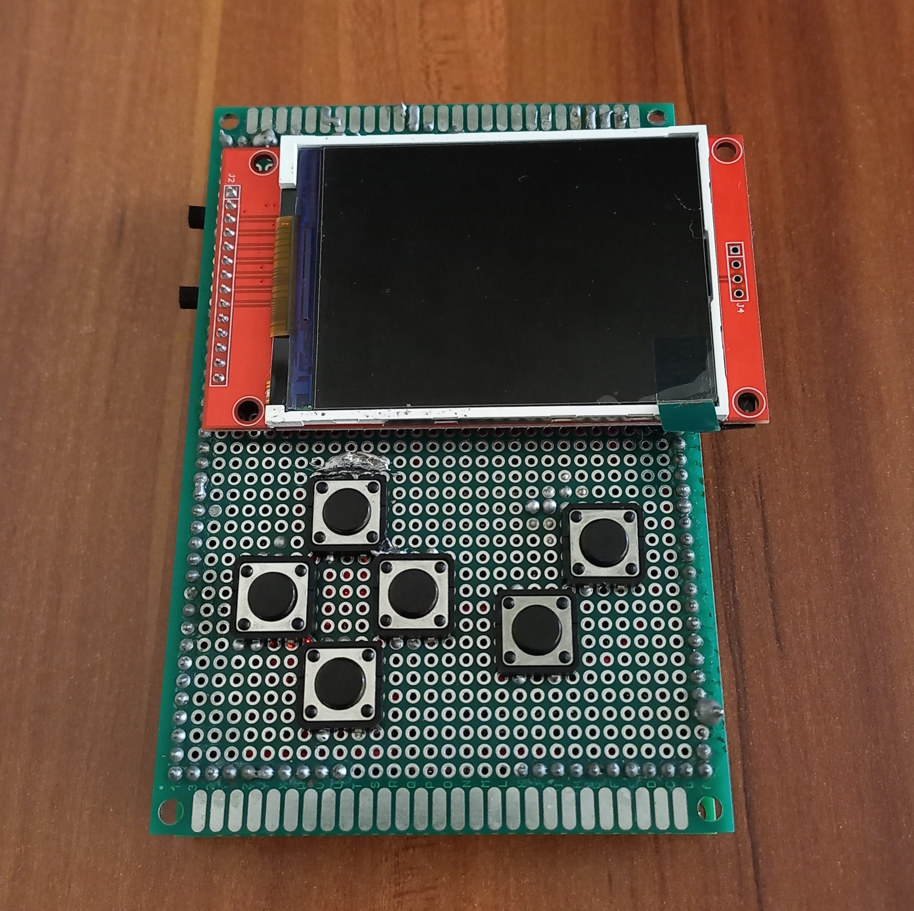
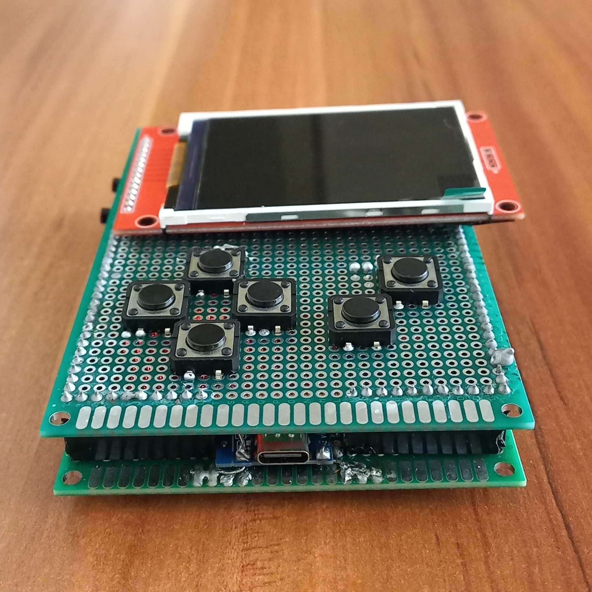
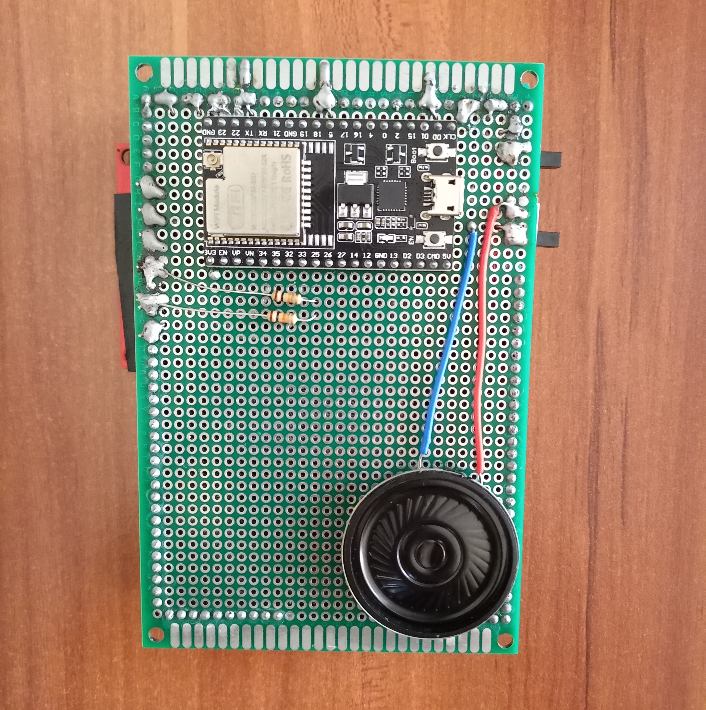
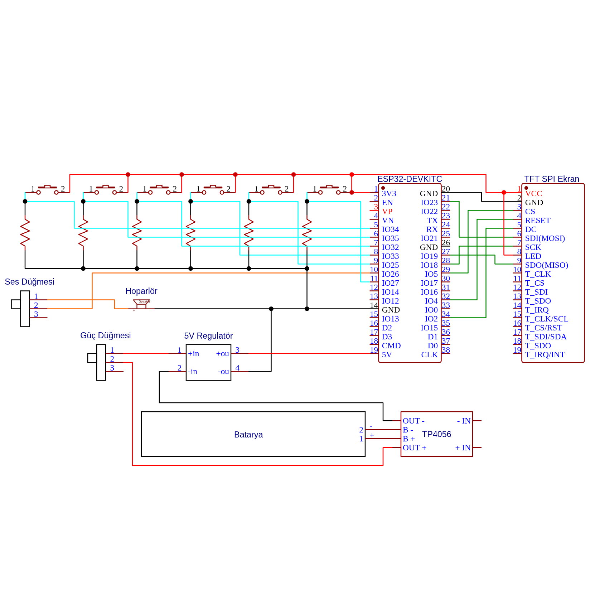
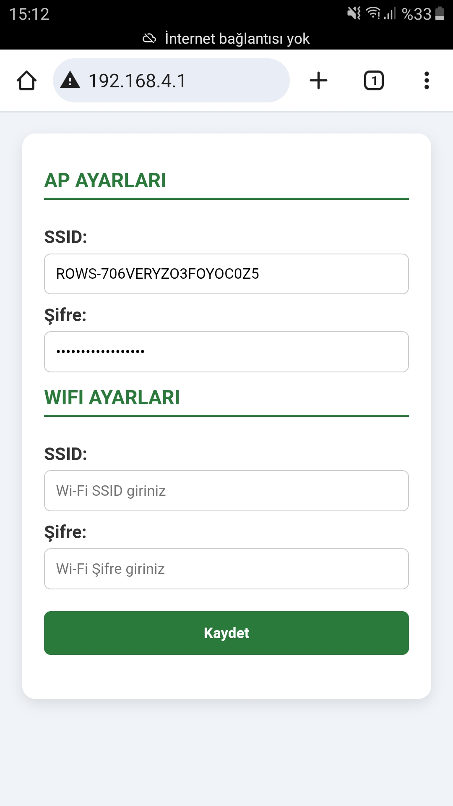

Proje kaynak kodlarına [GitHub üzerindeki bu repo](https://github.com/seymenkonuk/rows) aracılığıyla ulaşabilirsiniz.

## Açıklama
Bu proje, ESP32 tabanlı bir oyun konsolu ve eğitsel bir oyun yazılımını bir araya getirir. 
Hedefimiz, öğrencilerin algoritmik düşünme becerisini oyun yoluyla eğlenceli ve etkili biçimde geliştirmektir.  
Projede ayrıca, mobil uygulama ile öğretmen ve velilerin öğrenci ilerlemesini takip etmesi planlanmaktadır.

Sunduğu özellikler:
- ESP32 tabanlı taşınabilir oyun konsolu
- Eğitsel oyun içeriği ile algoritmik düşünme becerisi geliştirme
- TFT LCD ekran desteği
- Hoparlör ile kare dalga ses çıkışı
- Batarya ve TP4056 şarj modülü ile taşınabilirlik
- Wi-Fi üzerinden HTTP sunucu aracılığıyla cihazı yapılandırma
- Wi-Fi üzerinden yazılım güncellemesi (OTA)
- OTA güncellemeleri için PHP tabanlı backend sunucu  
- Backend ve cihaz arasında mTLS (mutual TLS) ile kimlik doğrulama  
- Mobil uygulama ile öğretmen ve velilere ilerleme takibi (geliştirme aşamasında)
- MQTT protokolü kullanılarak mobil uygulama ile oyun konsolu arasında anlık iletişim (geliştirme aşamasında)

### Proje Görselleri






## Oyun Hakkında

Bu oyun, “Ateş” karakterini yönlendirerek tüm paraları toplamayı ve suya temas etmeden en kısa yoldan çıkış kapısına ulaşmayı hedefler.

Oyun alanında iki zemin türü bulunur:
- **Orman**: Serbestçe yürüyebileceğin güvenli alanlar.
- **Buz**: Üzerinden geçtikçe eriyen ve bir daha adım atılamayan zeminler.



## Bileşenler

| Bileşen                      | Miktar |
|------------------------------|--------|
| ESP32                        | 1      |
| 2.8" SPI TFT Ekran (ILI9341) | 1      |
| Hoparlör                     | 1      |
| 3.7V 1S 40C Lipo Batarya     | 1      |
| TP4056 Şarj Modülü           | 1      |
| Regülatör                    | 1      |
| Buton                        | 6      |
| 90 Derece Sürgülü Switch     | 2      |
| 8x12cm Çift Yüzlü Pertinaks  | 2      |
| 1x40 Dişi Pin Header         | 4      |
| 1x40 Erkek Pin Header        | 4      |
| Direnç                       | 6      |
| Kablo                        | 10+    |

## Maliyet

| Bileşen                      | Tahmini Fiyat (TL) |
|------------------------------|--------------------|
| ESP32                        | 250                |
| 2.8" SPI TFT Ekran (ILI9341) | 500                |
| Hoparlör                     | 60                 |
| 3.7V 1S 40C Lipo Batarya     | 400                |
| TP4056 Şarj Modülü           | 15                 |
| Regülatör                    | 75                 |
| Buton                        | 40                 |
| 90 Derece Sürgülü Switch     | 10                 |
| 8x12cm Çift Yüzlü Pertinaks  | 100                |
| 1x40 Dişi Pin Header         | 35                 |
| 1x40 Erkek Pin Header        | 30                 |
| Direnç                       | 2                  |
| Kablo                        | 68                 |

*Toplam yaklaşık maliyet: 1585 TL*

## Devre Şeması



## Wi-Fi Yapılandırması

Cihaz kendi Wi-Fi ağını oluşturur (ROWS-\<Seri-Numarası\>).
- Bilgisayar veya mobil cihazınız ile bu ağa bağlanın.
- Ağın parolası `frontends/device-firmware/data/wifi/ap/PASS` dosyasında yazmaktadır.
- Tarayıcıdan `http://192.168.4.1` adresine gidin.
- Sizden istenen CN ve PASS bilgilerini giriniz.
- Açılan yapılandırma sayfasından Wi-Fi SSID ve parola bilgilerini giriniz.



## Kurulum

### Yapılandırma
1. [PlatformIO](https://platformio.org/) eklentili Visual Studio Code’u indirip kurun.  
2. Projeyi klonlayın:  
   ```bash
   git clone https://github.com/seymenkonuk/ROWS.git
   cd ROWS
	 ```
3. `frontends/device-firmware/include/rows_api.h` dosyasındaki \<your-domain\> kısmını değiştiriniz.
4. `utils/ecc-certificate-generator/cnf/server.cnf` dosyasındaki \<your-domain\> kısımlarını değiştiriniz.
5. backend'i çalıştırın (isteğe bağlı)

### Yükleme
1. `frontends/device-firmware` dizinini Visual Studio Code ile açın. Gerekli kütüphaneler otomatik yüklenecektir.
2. Her cihaz için benzersiz sertifika üretin:
```bash
cd utils/ecc-certificate-generator
./generate.sh reset
```
3. ESP32 cihazınızı bağlayıp PlatformIO üzerinden `Upload` yapın.
4. ESP32 cihazınızı bağlayıp PlatformIO üzerinden `Upload Filesystem Image` yapın.

## Gelecek Planlar

- Oyuna öğretici mod eklenmesi
- Mobil uygulamanın geliştirilmesi
- Yeni oyunların eklenmesi
- 3B yazıcı ile kasa tasarımı ve üretilmesi
